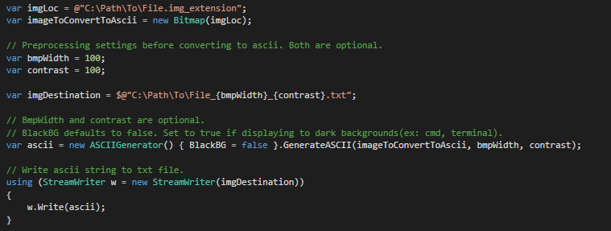
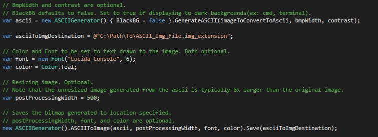
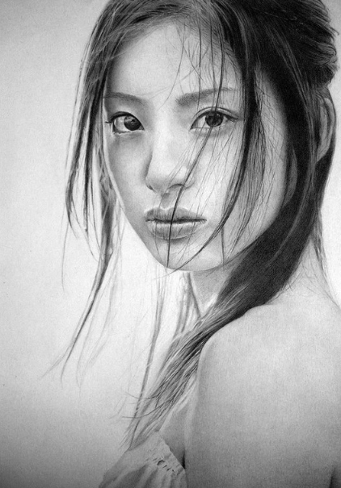
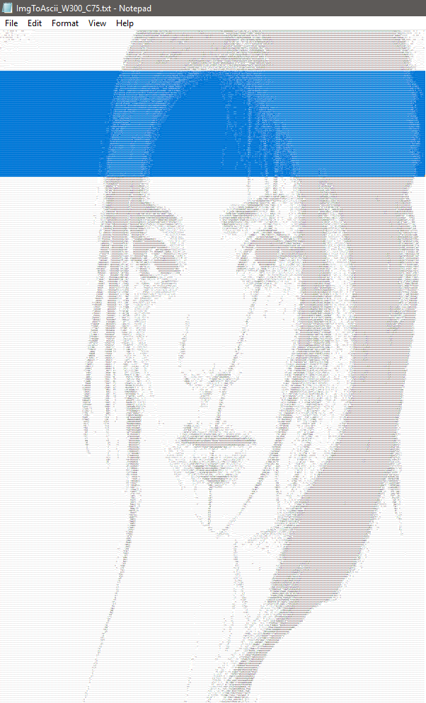
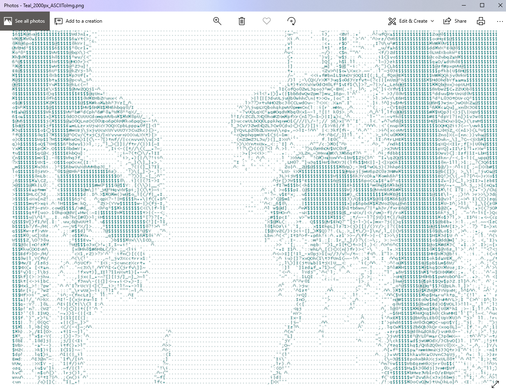

# ASCII-Generator

ASCII generator program than can convert an image into an ascii art, and that ascii art, into an image. 
Included are some image manipulation utility methods like grayscaling, contrast adjustment, and resizing.

Grayscaling and constrast adjustment methods use Lockbits instead of getPixels for a faster performance.

Windows GUI is made with Winforms.

## Demo

*Generates ascii string from image file.*

*Generates image from ascii string.*

## Screenshots

  

## Samples

[Samples folder](https://github.com/jnpco/ASCII-art/tree/master/ASCII-art/Demo/Samples)

- [ ] Make a web api. Most probably using AWS Lambda.
- [ ] Add limits to img sizes.
- [ ] Add color options for html.
- [ ] Fix aspect ratio.
- [ ] Rewrite core to c++ and GUI to Electron
