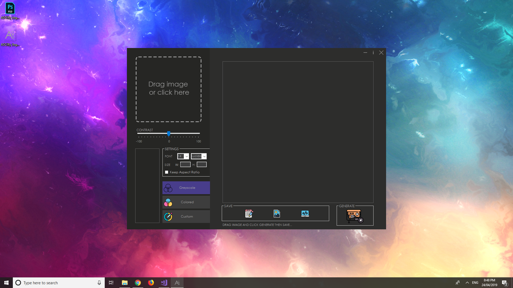
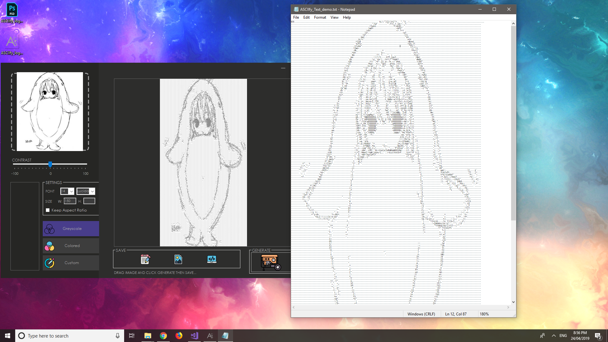
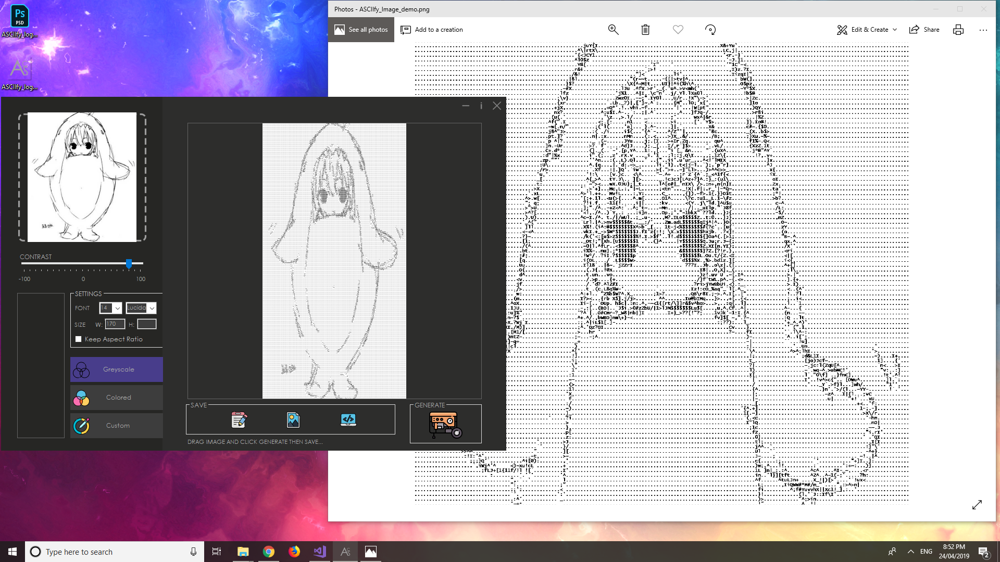

# ASCII-Generator

ASCII generator program than can convert an image into an ascii art, and that ascii art, into an image. 
Included are some image manipulation utility methods like grayscaling, contrast adjustment, and resizing.
Windows GUI is made with Winforms.

## Demo

  

## Samples

[Check out *_demo files to see output.](https://github.com/jnpco/ASCIIfy/tree/master/Demo)

- [ ] Make a web api. Most probably using AWS Lambda.
- [ ] Add limits to img sizes.
- [ ] Add html support.
- [ ] Add color options for image and html.
- [ ] Fix aspect ratio.
- [ ] Rewrite core to c++ and GUI to Electron
